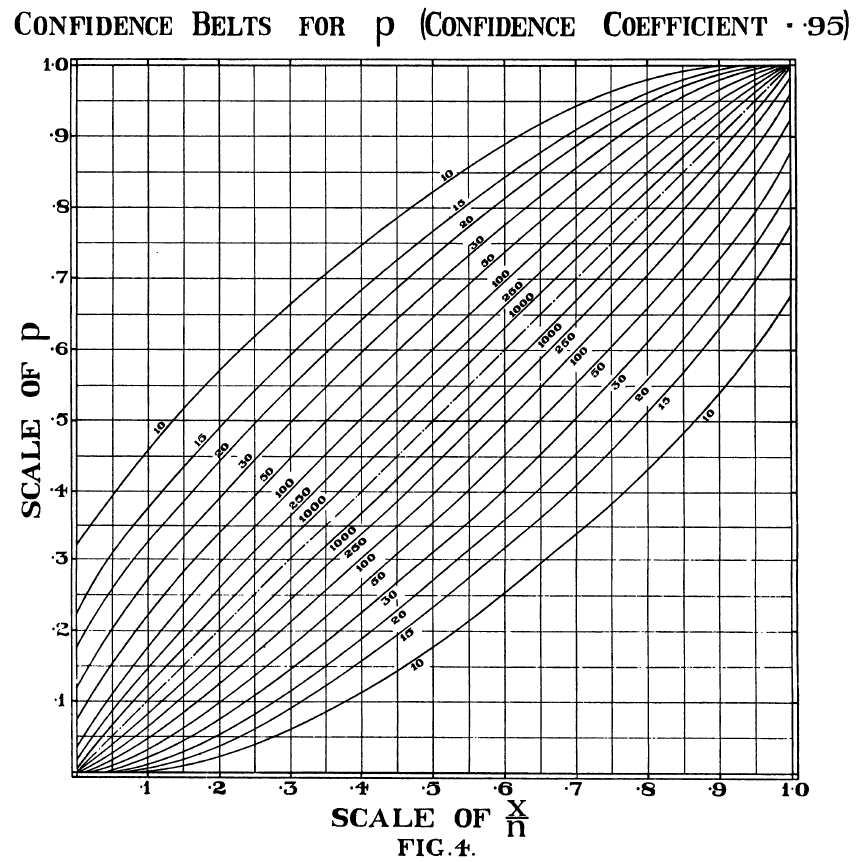
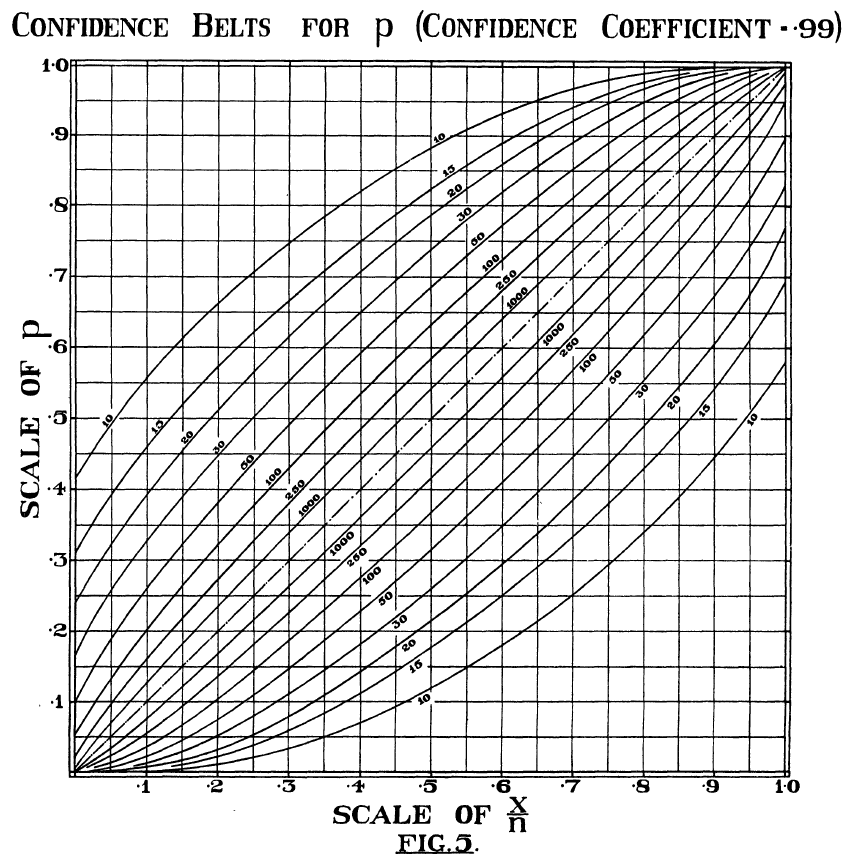

```{r setup, include = FALSE, eval = TRUE}
knitr::opts_chunk$set(echo = FALSE, eval = TRUE, fig.height = 3)

# Se cargan las librerias a utilizar
library(tidyverse)
library(readxl)
library(scales)
library(grid)
library(kableExtra)
library(latex2exp)
library(binom)
```

# Ejercicio 1
Lee el artículo de Tapia, José A. y Nieto, F. Javier. **Razón de posibilidades: una propuesta de traducción de la expresión odds ratio**. *Salud Pública de México*. Julio-Agosto, $1993$. Vol. $35$ No.$4$ Pág. $419-424$. Elabora un resumen en media cuartilla.

El artículo expone cómo las diversas traducciones hispánicas del término _odds ratio_ son imprecisas en distintos sentidos y propone un nuevo término que, según los autores, se adecua mejor tanto linguistica como conceptualmente al significado matemático original. Dentro del repaso histórico por las traducciones e interpretaciones imprecisas, discutidas por los autores, destacan las siguientes. $1$. La estipulación de _relative risk_ como sinónimo de _odds ratio_ en el diccionario de términos estadísticos del _International Statistical Institute_ (no obstante este error lingüistico, los autores señalan que el concepto matemático se mantuvo correcto). $2$. La confusión producida en textos epidemiológicos en los que se refería a otros términos para hacer alusión al concepto de _odds ratio_: desigualdad relativa, posibilidades relativas, riesgo relativo estimado, por ejemplo. $3$. La confusión del concepto matemático con su cálculo y el consecuente surgimiento de términos como _cross product ratio_ en los que pierde sentido linguüistico  la idea matemática original. $4$. La traducción específica como _razón de momios_ que sólo tiene sentido en México, por la similitud entre el uso anglosajón del término _odds_ (no la traducción literal) y el uso mexicano de _momios_. La confusión entre probabilidad y _odds_ reflejada en la traducción cpmo _relación_ o _razón de probabilidad_.
A partir de las razones mencionadas, los autores mencionan que ciertas propuestas de traducción, como _razón de ventaja_, han resultado salvaguardar el significado matemático de _odds ratio_ pero su articulación en frases resulta extraña al español. Por ello proponen traducir _odds_ como _posibilidades_ que además de ser compatible con el significado y uso del término inglés _odds_ permite articular frases que reflejan el sentido original del término.

# Ejercicio 2
¿Qué es la sensibilidad (*sensitivity*) y la especificidad (*specificity*) de una prueba? ¿Qué es la curva ROC? Busca algún ejemplo para ejemplificar estos conceptos.

Para estos dos casos, consideremos la siguiente tabla:
\begin{table}[H]
\centering
\begin{tabular}{l|l|l}
\diagbox{Prueba}{Realidad} & Positivo & Negativo \\
\toprule
Positivo & Verdadero positivo (TP) & Falso Positivo (FP) \\
\midrule
Negativo & Falso Negativo (FN) & Verdadero negativo (TN)
\end{tabular}
\end{table}

La **sensibilidad** de una prueba hacer referencia a la capacidad de la prueba para detectar "pacientes" que efectivamente tienen cierta condición (la prueba da positivo). Esto es, es el cociente que existe entre el número de verdaderos positivos dados por la prueba entre el total de pacientes que tienen la condición:
\begin{align*}
\mathrm{sensibilidad} &= \dfrac{TP}{TP + FN}
\end{align*}
En el caso de una prueba con una alta sensibilidad, se puede afirmar que un resultado negativo es útil para descartar la presencia de la condición (enfermedad). Sin embargo, un resultado positivo, en el caso de una prueba con alta sensibilidad, no se puede usar para confirmar (asegurar) que el paciente padece cierta condición.

La **especificidad** de una prueba hacer referencia a la capacidad de la prueba a detectar de forma correcta "pacientes"" carecen de cierta condición (la prueba da negativo). Esto es, es el cociente que existe entre entre los verdaderos negativos dados por la prueba entre el total de pacientes que efectivamente carecen de la condición en cuestión:
\begin{align*}
\mathrm{especificidad} &= \dfrac{TN}{TN + FP}
\end{align*}
En el caso de una prueba con alta especificidad, se puede afirmar que un resultado positivo es útil para confirmar la precencia del padecimiento de cierta condición (enfermedad). Mientras que, para un resultado negativo, en el caso de una pruba con alta especificidad, no se puede usar para confirmar que el paciente carece de cierto padecimiento.

La **curva ROC** es una representación gráfica de la sensibilidad respecto a la especificidad cuando se trabaja en pruebas de clasificación binaria (tiene el pedecimiento, carece del padecimiento). En el eje $X$ se coloca el valor de $1 - sensibilidad$ y en el eje $Y$ se coloca el valor de la especificidad. En el caso de la "prueba ideal" se tendría un valor de sensibilidad igual a 1 y un valor especificidad igual a 1, por lo que dicha prueba se colocaría en la coordenada $(1 - sensibilidad, especificidad) = (0, 1)$.

```{r}
datos <- tibble(sensibilidad = c(0.75, 0.25),
         especificidad = c(0.75, 0.25),
         etiqueta = c("Mejor", "Peor"))

tibble(sensibilidad = c(1, 0.75, 0.25, 0.75, 0.4, 0.7),
       especificidad = c(1, 0.75, 0.25, 0.5, 0.8, 0.2),
       etiqueta = c("Prueba\nperfecta", "Mejor", "Peor", "A", "B", "C")) %>% 
  ggplot(aes(x = 1 - sensibilidad, y = especificidad, label = etiqueta)) +
  geom_point() +
  geom_text(position = position_nudge(x = 0.05, y = -0.1)) +
  geom_abline(intercept = 0, slope = 1, color = "firebrick", linetype = 2, size = 1) +
  coord_cartesian(xlim = c(0, 1), ylim = c(0, 1)) +
  geom_segment(data = datos, aes(x = 0.5, y = 0.5,
                  xend = 1 - sensibilidad, yend = especificidad),
               size = 0.5, arrow = arrow(length = unit(0.5, "cm"))) +
  labs(title = "Curva ROC") +
  theme(plot.title = element_text(hjust = 0.5))
```

La gráfica anterior representa la posición de tres pruebas *prueba perfecta*, *prueba A* y *prueba B*. La prueba perfecta es, como se mencionó previamente, es aquella que tiene especificidad y sensibilidad igual a 1. La prueba A tiene una sensibilidad mayor respecto a la prueba B, pero tiene una especificidad menor que la prueba B. La prueba C no tiene un buen desempeño al tener el valor de 1 - sensibilidad y la especificidad por abajo de la recta puntada (el área "peor"), implica que su desempeño es peor que el de "adivinar" lanzando una moneda para determinar el resultado.

La gráfica anterior permite determinar de una forma visual la comparación entre el desempeño entre distintas pruebas. Por ejemplo, si nos interesa una prueba con alta sensibilidad, se tomaría la prueba A. Mientras que si serequiere una prueba con alta especificidad se elegirá la prueba B.

El nombre de "curva" proviene de la determinación sobre el comportamiento de cada una de las pruebas para distintos "puntos de corte". Esto es, al determinar una prueba es normal obtener como resultado un valor numérico entre 0 y 1 que indica la "probabilidad de padecer" cierta condición. En este caso, se determina un valor de probabilidad a partir del cual si el resultado de la prueba es mayor a este valor se considerará un resultado positivo y si el resultado de la prueba es menor a este valor se considerará un resultado negativo.

La selección de dicho punto de corte conlleva a que la tabla de contingencia se vea modificada al cambiar los valores de verdaderos positivo (TP), falsos positivos (FP), falsos negativos (FN) y verdaderos negativos (TN) y por ende cambia el valor de la sensibilidad y la especificidad. 

Lo anterior permite elegir el "punto de corte" de acuerdo con el objetivo de la prueba. Esto es, se requiere crear una prueba que me de una gran certeza que los resultados negativos aseguren una ausencia de una condición, entonces se desea elegir el punto de corte que nos de una alta sensibilidad. Si por el contrario, se busca que los resultados positivos aseguren la presencia de una condición, entonces se desea elegir el punto de corte que nos de una alta especificidad.

Como ejemplo, consideremos las pruebas A y B para determinar si una persona tiene diabetes. Ambas pruebas dan como resultado un "score" (valor entre 0 y 1), y por cada punto de corte definido para determinar si se padece o no diabetes se obtienen distintos valores de sensibilidad y especificidad (ver gráfica inferior).

```{r}
tibble(sensibilidad = c(1, 0.98, 0.95, 0.90, 0.88, 0.88, 0.85, 0.81, 0.76, 0.63, 0.2, 0,
                        1, 0.95, 0.92, 0.87, 0.82, 0.79, 0.79, 0.79, 0.75, 0.63, 0.1, 0),
       especificidad = c(0, 0.1, 0.62, 0.62, 0.73, 0.78, 0.81, 0.88, 0.88, 0.93, 0.95, 1,
                         0, 0.05, 0.57, 0.61, 0.68, 0.87, 0.90, 0.94, 0.97, 0.97, 0.98, 1),
       prueba = c(rep("A", 12), rep("B", 12))) %>% 
  ggplot(aes(x = 1 - sensibilidad, y = especificidad, color = prueba)) +
  geom_line(size = 1) +
  scale_color_manual(name = "Prueba", values = c("steelblue", "orchid")) +
  geom_abline(intercept = 0, slope = 1, color = "firebrick", linetype = 2, size = 1) +
  coord_cartesian(xlim = c(0, 1), ylim = c(0, 1)) +
  labs(title = "Curva ROC") +
  theme(plot.title = element_text(hjust = 0.5))
```


# Ejercicio 3
En el artículo Clopper, C. J. & Pearson, E. S. 1934. **The Use of Confidence or Fiducial Limits Illustrated in the Case of the Binomial**. *Biometrika*, Vol. 26, No. 4, vienen las tablas para calcular un intervalo EXACTO de confianza para p. Úsa esas tablas para calcular un intervalo al 95% y otro al 99% para una muestra tamaño $n = 50$ y $x = 9$.

No se encontraron las tablas en el artículo, pero se encontraron las gráficas asociadas a dichas tablas. Se usarán estas gráficas para obtener los intervalos de confianza.

El procedimiento para encontrarlos es fijar el valor de $x$ en el eje horizontal y seguir una línea recta vertical hasta itnersectar las dos curvas que esten asociadas al valor de $n$. Ahí se obtendrá la coordenada en $y$ reference a los límites inferior y superior del intervalo de confianza para $p$.

{ width=48% } { width=48% }

Para el caso de $n = 50$ y $x = 9$, con un intervalo de confianza al $95\%$, se tiene $(0.775, 0.960)$.

Para el caso de $n = 50$ y $x = 9$, con un intervalo de confianza al $99\%$, se tiene $(0.740, 0.975)$.


# Ejercicio 4
Indica el esquema de muestreo y la hipótesis nula y alternativa para cada uno de los siguientes ejemplos:

## Ejemplo a)
En un hospital se decide registrar el número de parejas que lleguen en 1 año con la finalidad de someterse a un tratamiento de fertilidad. Al cabo del año, se genera una tabla en donde se registra el grupo de edad de la mujer al iniciar el tratamiento (20 a 30 y 31 a 45) y el resultado (embarazo o no embarazo).

El esquema de muestreo es **Poisson**

Las hipótesis nula y alternativa son:
\begin{align*}
\mathrm{H}_0 &= \text{Edad y resultado (del tratamiento) no estan relacionados} \\
\mathrm{H}_a &= \text{Edad y resultado presentan algún grado de asociación}
\end{align*}


## Ejemplo b)
En un hospital de quiere evaluar la asociación entre edad de la mujer y resultado de un tratamiento de fertilidad. Se establece al inicio del estudio que se registraran los resultados de 722 personas. Al finalizar el tratamiento se genera una tabla en donde se registra el grupo de edad de la mujer al iniciar el tratamiento (20 a 30 y 31 a 45) y el resultado (embarazo o no embarazo).

El esquema de muestreo es **Multinomial**

Las hipótesis nula y alternativa son:
\begin{align*}
\mathrm{H}_0 &= \text{Las variables edad y resultado (del tratamiento) son independientes} \\
\mathrm{H}_a &= \text{Las variables edad y resultado presentan algún grado de dependencia}
\end{align*}
Expresado en términos de ecuaciones se tiene
\begin{align*}
\mathrm{H}_0 &= \mathrm{P} (edad, resultado) = \mathrm{P} (edad) \cdot \mathrm{P}(resultado)  \\
\mathrm{H}_a &= \mathrm{P} (edad, resultado) \neq \mathrm{P} (edad) \cdot \mathrm{P}(resultado)
\end{align*}

## Ejemplo c)
En un hospital de quiere evaluar sí el resultado de un tratamiento de fertilidad cambia de acuerdo a la edad de la mujer que desea embarazarse. Para ello se deciden registrar los resultados de 350 mujeres cuya edad está entre los 20 y 30 años, y 360 mujeres cuya edad está entre los 31 y 45 años. Al finalizar el tratamiento se genera una tabla en donde se registra el grupo de edad de la mujer al iniciar el tratamiento y el resultado (embarazo o no embarazo)

El esquema de muestreo es **Multinomial-Producto**

Las hipótesis nula y alternativa son:
\begin{align*}
\mathrm{H}_0 &= \text{Hay homogeneidad en los resultados respecto a los dos grupos de mujeres} \\
\mathrm{H}_a &= \text{No hay homogeneidad en los resultados respecto a los dos grupos de mujeres}
\end{align*}

Si denotamos por $p_{1}$ la distribución de probabilidad del resultado (del tratamiento) para las mujeres con edad entre 20 a 30 años y por $p_{2}$ la disribución de probabilidad del resultado (del tratamiento) para las mujeres con edad entre 31 a 45 años, entonces
\begin{align*}
\mathrm{H}_0 = p_{1} = p_{2} \qquad \text{v.s.} \qquad \mathrm{H}_a = p_{1} \neq p_{2}
\end{align*}


# Ejercicio 5
Los datos del ejemplo $4a)$ se han resumido en la siguiente tabla:
\begin{table}[H]
\centering
\begin{tabular}{l|l|l}
\toprule
\diagbox{Edad de la mujer}{Resultado} & Embarazo & No Embarazo \\
\midrule
20 a 30 años & 26 & 85 \\
\midrule
31 a 45 años & 146 & 565 \\
\bottomrule
\end{tabular}
\end{table}

## Inciso 5.1
Realicen *a mano* la prueba de Ji cuadrada. Concluyan.


```{r}
edad <- c("20-30", "31-45", "20-30", "31-45")
resultado <- c("embarazo", "embarazo", "no embarazo", "no embarazo")
conteos <- c(26, 146, 85, 565)
tabla <- data.frame(resultado, edad, conteos)
tabla <- xtabs(conteos ~ edad + resultado, data = tabla)
tabla
```
Calculando las marginales:

Dimensión 1 (filas)
```{r}
totalFilas <- margin.table(tabla, 1)
totalFilas
```
Dimensión 2 (columnas)
```{r}
totalColumnas <- margin.table(tabla, 2)
totalColumnas
```

Y el total

```{r}
total <- sum(tabla)
total
```

Ahora calculamos los valores esperados

```{r, echo=TRUE}

esperados <- c(totalFilas[1]*totalColumnas[1]/total, 
                totalFilas[2]*totalColumnas[1]/total,
                totalFilas[1]*totalColumnas[2]/total,
                totalFilas[2]*totalColumnas[2]/total
              )
esperados

```

Y obtenemos las diferencias cuadradas entre los observados y esperados. Y luego las dividimos entre esperados

```{r}
diferencias2 <- (conteos-esperados)^2
dif2_esp <- diferencias2 / esperados
dif2_esp
```

Finalmente, obtenemos la Chi cuadrada al sumar  estos valores

```{r}
chi2 <- sum(dif2_esp)
chi2
```

Y realizamos la prueba. Sabiendo que la prueba tiene $1$ grado de libertad. 
```{r}
p <- 1- pchisq(chi2, 1)
p
```

Dado este resultado, no podemos rechazar la hipótesis nula y concluir que exista relación entre la prueba de embarazo y la edad.

## Inciso 5.2
Corroboren el resultado en R. Muestren el resultado.

Aplicamos el comando *chisq.test()* y obtenemos el mismo resultado.
```{r}
prueba <- chisq.test(xtabs(conteos ~ edad + resultado, data = tabla,
                           ), simulate.p.value=TRUE)
prueba
```


## Inciso 5.3
Calculen la probabilidad de embarazo para mujeres de $20 - 30$ años y la probabilidad de embarazo para mujeres de $31 - 45$ años

La probabilidad de embarazo para mujeres de entre $20$ y $30$ años es 
```{r}
pEmb2030 = conteos[1]/ totalFilas[1]
pEmb2030
```

La probabilidad de embarazo para mujeres de entre $31$ y $45$ años es 
```{r}
pEmb3145 = conteos[2]/ totalFilas[2]
pEmb3145
```


## Inciso 5.4
Calculen el Odds Ratio a mano y en R. Interpreten el valor OR y los límites superior e inferior del intervalo de confianza.

Calculemos primero la probabilidad de no embarazo dado que se pertenece a ambos grupos:

```{r}
pNEmb2030 = conteos[3]/ totalFilas[1]
pNEmb2030
pNEmb3145 = conteos[4]/ totalFilas[2]
pNEmb3145
```

Así, el *odds ratio* es el siguiente
```{r}
or <- pEmb2030/pNEmb2030/pEmb3145/pNEmb3145
or[1]
```

El valor del $or$ podemos interpretarlo como que hay más posibilidades de embarazo que de no embarazo si se tienen de $20$ a $30$ años en vez de $31$ a $45$ años.

Para calcular el intervalo de confianza (al $95%$) primero calculamos el error
```{r, echo=TRUE}
error <- sqrt((1/conteos[1])+(1/conteos[2]) +(1/conteos[3]) +(1/conteos[4]))
```

Y luego los límites

```{r, echo=TRUE}
LI <- exp(log(or)-1.96*error)
LS <- exp(log(or)+1.96*error)
```

De esta manera, tenemos que el límite inferior es ```{r} LI ``` y el superior ```{r} LS ```. Podemos decir entonces, que con un nivel de confianza del $95%$ el verdadero valor del *odds ratio* caerá en este intervalo.


## Inciso 5.5
Calculen el Relative Risk a mano y en R. Interpreten el valor RR y los límites superior e inferior del intervalo de confianza.

```{r}
rr= (conteos[1]/(conteos[1]+ conteos[3]))/(conteos[2]/(conteos[2]+ conteos[4]))
rr
```

El error para el *risk ratio* es

```{r}
 es <- sqrt(((1- pEmb2030)/(totalFilas[1]*pEmb2030))+((1- pNEmb2030)/(totalFilas[2]*pNEmb2030)))
```

El interalo de confianza asociado es 
```{r}
ll <- rr-1.96*es
ul <- rr+1.96*es
```

De esta manera, tenemos que el límite inferior es ```{r} ll ``` y el superior ```{r} ul ```. Podemos decir entonces, que con un nivel de confianza del $95%$ el verdadero valor del *risk ratio* caerá en este intervalo.

# Ejercicio 6
Se realizó un estudio en la India para determinar la asociación entre dos tipos de virus de papiloma humano con la aparición en las lesiones del cérvix. Realicen una prueba exacta de Fisher “a mano” y en R. Interpreten.

\begin{table}[H]
\centering
\begin{tabular}{l|l|l}
\toprule
\diagbox{Tipo de Virus}{Cervix} & Sin lesiones & Con lesiones \\
\midrule
HPV 11 & 47 & 3 \\
\midrule
HPV 16 & 14 & 42 \\
\bottomrule
\end{tabular}
\end{table}

# Ejercicio 7
Comparación de métodos para generar intervalos de confianza.

## Inciso 7.1
Generen intervalos de confianza al $99\%$ para una $p$ estimada de $p = 0.9$ y $p = 0.5$ con $n = 10, 20, 30, 40, 50, 60, 70, 80, 90, 100$ usando los comandos `binom.exact`, `binom.wilson` y `binom.asymp`.

El código utilizado en `R` es el siguiente:
```{r, eval = FALSE}
# Intervalos de confianza al 99% para p = 5
binom.exact(seq(5,50,5), seq(10, 100, 10),conf.level = 0.99)
binom.wilson(seq(5,50,5), seq(10, 100, 10),conf.level = 0.99)
binom.asymp(seq(5,50,5), seq(10, 100, 10),conf.level = 0.99)

# Intervalos de confianza al 99% para p = 9
binom.exac(seq(9,90,9), seq(10, 100, 10),conf.level = 0.99)
binom.wilson(seq(9,90,9), seq(10, 100, 10),conf.level = 0.99)
binom.asymp(seq(9,90,9), seq(10, 100, 10),conf.level = 0.99)
```

## Inciso 7.2
Muestra los límites de los intervalos generados a través de los tres métodos

```{r}
renombrar <- function(x, prefijo) {paste0(prefijo, ".",x)}


exacto9 <- binom.exact(seq(9,90,9), seq(10, 100, 10),conf.level = 0.99) %>% 
          as_tibble() %>% 
          mutate(method = as.character(method)) %>% 
          rename_all(funs(renombrar), prefijo = "exacto")

wilson9 <- binom.wilson(seq(9,90,9), seq(10, 100, 10),conf.level = 0.99) %>% 
          as_tibble() %>% 
          mutate(method = as.character(method)) %>% 
          rename_all(funs(renombrar), prefijo = "wilson")
          
asymp9 <- binom.asymp(seq(9,90,9), seq(10, 100, 10),conf.level = 0.99) %>% 
          as_tibble() %>% 
          mutate(method = as.character(method)) %>% 
          rename_all(funs(renombrar), prefijo = "asymp")

intervalos9 <- exacto9 %>% 
              inner_join(wilson9, by = c("exacto.x" = "wilson.x", "exacto.n" = "wilson.n", "exacto.mean" = "wilson.mean")) %>% 
              inner_join(asymp9, by = c("exacto.x" = "asymp.x", "exacto.n" = "asymp.n", "exacto.mean" = "asymp.mean")) %>% 
              select(-ends_with("method")) %>% 
              rename(x = exacto.x,
                     n = exacto.n,
                     mean = exacto.mean)
intervalos9 %>% 
  knitr::kable(format = "latex", booktabs = TRUE, longtable = TRUE, linesep = "",
               escape = FALSE, digits = 3,
               caption = "Intervalos de confianza para p = 0.9",
               col.names = c("x", "n", "media", rep(c("Inferior", "Superior"), 3))) %>% 
  row_spec(0, align = "c") %>% 
  add_header_above(c("", "", "", "exacto" = 2, "wilson" = 2, "asymp" = 2)) %>%
  kableExtra::kable_styling(latex_options = c("striped", "repeat_header"))
```

```{r}
exacto5 <- binom.exact(seq(5,50,5), seq(10, 100, 10),conf.level = 0.99) %>% 
          as_tibble() %>% 
          mutate(method = as.character(method)) %>% 
          rename_all(funs(renombrar), prefijo = "exacto")

wilson5 <- binom.wilson(seq(5,50,5), seq(10, 100, 10),conf.level = 0.99) %>% 
          as_tibble() %>% 
          mutate(method = as.character(method)) %>% 
          rename_all(funs(renombrar), prefijo = "wilson")
          
asymp5 <- binom.asymp(seq(5,50,5), seq(10, 100, 10),conf.level = 0.99) %>% 
          as_tibble() %>% 
          mutate(method = as.character(method)) %>% 
          rename_all(funs(renombrar), prefijo = "asymp")

intervalos5 <- exacto5 %>% 
              inner_join(wilson5, by = c("exacto.x" = "wilson.x", "exacto.n" = "wilson.n", "exacto.mean" = "wilson.mean")) %>% 
              inner_join(asymp5, by = c("exacto.x" = "asymp.x", "exacto.n" = "asymp.n", "exacto.mean" = "asymp.mean")) %>% 
              select(-ends_with("method")) %>% 
              rename(x = exacto.x,
                     n = exacto.n,
                     mean = exacto.mean)
intervalos5 %>% 
  knitr::kable(format = "latex", booktabs = TRUE, longtable = TRUE, linesep = "",
               escape = FALSE, digits = 3,
               caption = "Intervalos de confianza para p = 0.5",
               col.names = c("x", "n", "media", rep(c("Inferior", "Superior"), 3))) %>% 
  row_spec(0, align = "c") %>% 
  add_header_above(c("", "", "", "exacto" = 2, "wilson" = 2, "asymp" = 2)) %>%
  kableExtra::kable_styling(latex_options = c("striped", "repeat_header"))
```

## Inciso 7.3
Realicen una gráfica en donde comparen los intervalos generados por los tres métodos y las dos p estimadas

```{r, fig.height = 3}
colnames(exacto9) <- c("method", "x", "n", "mean", "lower", "upper")
colnames(wilson9) <- colnames(exacto9)
colnames(asymp9) <- colnames(exacto9)

bind_rows(exacto9, wilson9, asymp9) %>% 
  as_tibble() %>% 
  ggplot(aes(x = n)) +
  geom_hline(yintercept = 1, color = "firebrick", linetype = 2) + 
  geom_point(aes(y = mean)) +
  geom_point(aes(y = lower, color = method)) +
  geom_point(aes(y = upper, color = method)) +
  labs(title = "Comparación de intervalos de confianza para p = 0.9",
       x = "n",
       y = "media",
       color = "método") +
  scale_color_brewer(type = "qual", palette = "Dark2") +
  theme(plot.title = element_text(hjust = 0.5))
```

```{r, fig.height = 3}
colnames(exacto5) <- c("method", "x", "n", "mean", "lower", "upper")
colnames(wilson5) <- colnames(exacto5)
colnames(asymp5) <- colnames(exacto5)

bind_rows(exacto5, wilson5, asymp5) %>% 
  as_tibble() %>% 
  ggplot(aes(x = n)) +
  geom_hline(yintercept = 1, color = "firebrick", linetype = 2) + 
  geom_point(aes(y = mean)) +
  geom_point(aes(y = lower, color = method)) +
  geom_point(aes(y = upper, color = method)) +
  labs(title = "Comparación de intervalos de confianza para p = 0.5",
       x = "n",
       y = "media",
       color = "método") +
  scale_color_brewer(type = "qual", palette = "Dark2") +
  theme(plot.title = element_text(hjust = 0.5))
```


## Inciso 7.4
¿Cuál método elegirían? ¿Cuál método no elegirían? ¿Por qué?

En la gráfica de intervalos de confianza al $99\%$ para $p = 0.9$, notamos que el método `binom.asymp` contiene parte del intervalo de confiana mayor a $p = 1$ para valores con $n < 60$. Por tal motivo este método no lo usaríamos cuando $p$ sea cercano a $0.9$.

Graficando la longitud de los intervalos de confianza para $p = 0.9$, y considerando que `binom.asymp` no lo usaremos por exceder el valor de $p = 1$. Notamos que el método `binom.wilson` es el que genera los intervalos de confianza de menor longitud. Por lo que, para el caso en que $p approx 0.9$ es mejor utilizar el método **Wilson** para obtener el intervalos de confianza.

```{r, fig.height = 3}
bind_rows(exacto9, wilson9, asymp9) %>% 
  as_tibble() %>% 
  mutate(longitud = upper - lower) %>% 
  ggplot(aes(x = n, y = longitud, color = method)) +
  geom_line(size = 1) +
  labs(title = "Comparación de intervalos de confianza para p = 0.9",
       x = "n",
       y = "longitud intervalo",
       color = "método") +
  scale_color_brewer(type = "qual", palette = "Dark2") +
  theme(plot.title = element_text(hjust = 0.5))
```

Para el caso cuando $p = 0.5$ se observa todos los métodos tienen intervalos de confianza dentro del rango $(0, 1)$. Por lo tanto, usaremos el criterio de menor longitud para seleccionar el método para el cálculo del intervalos.

En la gráfica inferior, se observa que el intervalo generado con `binom.wilson` es el que tiene la menor longitud para los valores de $n$ en el rango de $n = 10, \ldots, 100$. Por lo tanto, para el caso en que $p \approx 0.5$ se usará el método de **Wilson** para obtener el intervalo de confianza.

```{r, fig.height = 3}
bind_rows(exacto5, wilson5, asymp5) %>% 
  as_tibble() %>% 
  mutate(longitud = upper - lower) %>% 
  ggplot(aes(x = n, y = longitud, color = method)) +
  geom_line(size = 1) +
  labs(title = "Comparación de intervalos de confianza para p = 0.5",
       x = "n",
       y = "longitud intervalo",
       color = "método") +
  scale_color_brewer(type = "qual", palette = "Dark2") +
  theme(plot.title = element_text(hjust = 0.5))
```

